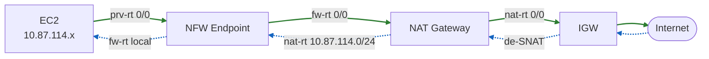

# 使用 AWS Network Firewall 检测带有 NAT 的出站流量

本方案在 `nfw-vgw-demo` 的基础上 fork 而来。原有的「VGW + Site-to-Site VPN + BGP + NFW 模拟 DX 专线检测 IDC 流量」架构完整保留，在此之上为云上 VPC 增加了自己的 Internet Gateway 和 NAT Gateway，使云上 EC2 能够访问互联网，并让这条出站流量被 NFW 审查。

与原 `nfw-vgw-demo` 的差异：**本方案的出站检查路由（即南北向流量）由 CloudFormation 模板在创建时自动生效，创建完成后 NFW 立即开始扫描出站互联网流量，无须手工配置**。而模拟 IDC 到云上 VPC 的东西向检测路由则与原方案保持一致：创建完毕后默认不经过 NFW，需由运维人员手工修改路由表将流量送往 NFW 才生效。

全文技术术语缩写与原方案保持一致：

| 全称 | 简称 |
| --- | --- |
| Network Firewall | NFW |
| Internet Gateway | IGW |
| NAT Gateway | NAT |
| Transit Gateway | TGW |
| Direct Connect | DX |
| CloudFormation | CFN |
| Virtual Private Gateway | VGW |

## 一、使用 NFW 检测带有 NAT 的出站流量的架构设计

### 1、东西向和南北向流量是否需要两个 NFW 

首先定义方向：

- 东西向：水平方向，例如 VPC 和 IDC 之间，或者 VPC 之间。
- 南北向：垂直方向，例如 VPC 去互联网，从互联网入 VPC。

本方案的南北向流量中，云上 VPC 目前没有从互联网入站的流量（没有 ELB，EC2 也没有 EIP），因此 NFW 只检测 EC2 主动发起、去往互联网方向的出站流量。

东西向和南北向可共用一套 NFW ，也就是一个 NFW Profile，在 NFW Rule Group 部分，只要填写正确的扫描规则即可。

本方案没有从互联网入站的流量，因此每个 AZ 只需 1 个 NFW Endpoint 即可同时承载出站（南北向）检测；若将来加入对外入站业务（如 ELB）并且也要保留 source IP，那时每个 AZ 可能需要 2 个 Endpoint 来分别处理入站与出站。

### 2、要保留 source ip 应先 NAT 后 NFW 还是先 NFW 后 NAT

出站流量经过 NAT 和 NFW，有两种串联顺序，二者的核心区别在于 NFW 看到的源 IP 不同。

#### (1) 先 NAT 后 NFW（NFW 在 NAT 与 IGW 之间）

流量路径为 `EC2 → NAT → NFW → IGW`。NAT 先做了 SNAT，把源地址换成了 NAT 的 EIP，因此 NFW 看到的所有出站流量源 IP 都是 NAT 的公网地址，无法区分是哪一台 EC2 发出的。这种顺序会**丢失原始 source ip**，不利于按业务子网或单机做策略与审计。

#### (2) 先 NFW 后 NAT（NFW 在 EC2 与 NAT 之间）

流量路径为 `EC2 → NFW → NAT → IGW`。NFW 先于 NAT 检查，此时报文源地址仍是 EC2 的私网地址（`10.87.114.x` / `10.87.113.x`），NFW 日志和规则都能看到真实的 source ip，可以基于业务子网精确制定策略。NAT 只在流量离开 NFW 之后才做 SNAT。

#### (3) 本方案的选择

为保留 source ip，本方案采用**先 NFW 后 NAT**。同时把 NFW Endpoint 放在每个 AZ 的业务子网与 NAT 之间，回程流量在 NAT 完成 de-SNAT 后再被引导回同一个 NFW Endpoint，保证有状态引擎能同时看到一条连接的来回两个方向，避免非对称路由导致丢包。

为保持可用区隔离，NAT 与 NFW Endpoint 均按 AZ 成对部署，AZ1 的业务流量只走 AZ1 的 NFW Endpoint 与 AZ1 的 NAT，AZ2 同理，避免跨 AZ 流量与额外费用。

### 3、流量进出 NAT 和 NFW 的路由表设计

本方案在原项目 `nfw-vgw-demo` 的基础上新增以下资源（均为本 fork 新增，不影响原有 VGW/VPN/BGP 部分）：

- 1 个 Internet Gateway：`Inspection IGW`
- 2 个 NAT 子网（公有）：`NAT subnet AZ1` = `10.87.116.0/28`，`NAT subnet AZ2` = `10.87.116.16/28`
- 2 个 NAT Gateway（各带 1 个 EIP）：`NAT Gateway AZ1`、`NAT Gateway AZ2`
- 2 张 NAT 子网路由表：`nat-rt-az1`、`nat-rt-az2`

子网 CIDR 设计上：

- 业务子网不变（`10.87.114.0/24`、`10.87.113.0/24`）
- 防火墙子网不变（`10.87.115.0/28`、`10.87.115.16/28`）
- 新增 NAT 子网（`10.87.116.0/28`、`10.87.116.16/28`）。

#### (1) 出站方向路由（去互联网）

| 路由表 | 关联对象 | 目的 CIDR | 下一跳 | 说明 |
|---|---|---|---|---|
| `prv-rt-az1` | 业务子网 AZ1 | `0.0.0.0/0` | NFW Endpoint AZ1 | 默认去互联网先送 NFW（本模板自动创建）|
| `prv-rt-az2` | 业务子网 AZ2 | `0.0.0.0/0` | NFW Endpoint AZ2 | 同上 |
| `fw-rt-az1` | 防火墙子网 AZ1 | `0.0.0.0/0` | NAT Gateway AZ1 | NFW 检查后送 NAT 做 SNAT |
| `fw-rt-az2` | 防火墙子网 AZ2 | `0.0.0.0/0` | NAT Gateway AZ2 | 同上 |
| `nat-rt-az1` | NAT 子网 AZ1 | `0.0.0.0/0` | Inspection IGW | SNAT 后出公网 |
| `nat-rt-az2` | NAT 子网 AZ2 | `0.0.0.0/0` | Inspection IGW | 同上 |

#### (2) 回程方向路由（从互联网返回）

回程报文到达 NAT 完成 de-SNAT 后，目的地址变回 EC2 的私网地址。NAT 子网路由表用一条比本地 `10.87.0.0/16` 更精确的 `/24` 路由，把回程流量引回 NFW Endpoint，确保来回都过防火墙：

| 路由表 | 目的 CIDR | 下一跳 | 说明 |
|---|---|---|---|
| `nat-rt-az1` | `10.87.114.0/24` | NFW Endpoint AZ1 | 回程引回防火墙（更长掩码优先于 local）|
| `nat-rt-az2` | `10.87.113.0/24` | NFW Endpoint AZ2 | 同上 |

NFW Endpoint 完成回程检查后，按防火墙子网路由表的 `local` 路由把报文直接送回业务子网的 EC2。

#### (3) 完整流量路径



> 实线（绿色）为出站方向 `EC2 → NFW → NAT → IGW → Internet`；虚线（蓝色）为回程方向 `Internet → IGW → NAT(de-SNAT) → NFW → EC2`。来回都经过 NFW，保证有状态检测对称。

#### (4) 与原 IDC 东西向检测互不冲突

防火墙子网与业务子网仍保留 VGW 路由传播。BGP 传播过来的 IDC 网段（`10.0.0.0/8`、`10.132.66.0/24`）掩码比 `0.0.0.0/0` 更精确，因此去 IDC 的东西向流量仍走 VGW，只有去互联网的默认流量才会命中本方案新增的 `0.0.0.0/0 → NFW → NAT` 路径。原方案中由运维手工切换 IDC 检测路由的实验流程保持不变。

## 二、使用 CFN 模板启动环境

### 1、模板位置与作用

模板文件：`cloudformation/vpc-dual-az-vgw-vpn-bgp-nfw-nat-create.yaml`

该模板在原 `nfw-vgw-demo` 模板基础上 fork，新增了 IGW、NAT 子网、NAT Gateway、NAT 路由表，以及出站域名拦截规则，并自动写好出站检查路由。创建完成后即可直接验证 NFW 对出站流量的检测，无须手工配置路由。

### 2、创建前置条件

- 在目标区域已有一个 EC2 密钥对（`KeyPairName` 参数引用，用于 EC2 SSH，本方案登录主要用 SSM）
- 账号默认 EIP 配额足够（本模板使用 3 个 EIP：strongSwan 1 个 + NAT 2 个）
- 具备创建 VPC、NFW、NAT、IAM、Lambda、CloudWatch Logs 的权限

### 3、创建步骤

- 1) 进入 CloudFormation 控制台，选择创建 Stack，上传模板 `vpc-dual-az-vgw-vpn-bgp-nfw-nat-create.yaml`
- 2) 填写 Stack 名称，选择 `KeyPairName`，其余参数可用默认值（VPN 预共享密钥建议改为自定义值）
- 3) 在权限确认页面勾选允许创建 IAM 资源，提交创建
- 4) 等待约 20-30 分钟，Stack 状态变为 `CREATE_COMPLETE`

也可使用 CLI 创建：

```bash
aws cloudformation create-stack \
  --stack-name nfw-nat-demo \
  --template-body file://cloudformation/vpc-dual-az-vgw-vpn-bgp-nfw-nat-create.yaml \
  --parameters ParameterKey=KeyPairName,ParameterValue=<你的密钥对名称> \
  --capabilities CAPABILITY_IAM
```

### 4、创建完成后的状态

- CloudFormation 显示 Stack 创建完成
- NFW 已创建并就绪，两个 AZ 的 NFW Endpoint 已生成
- 出站检查路由已由模板自动写入 `prv-rt`、`fw-rt`、`nat-rt`，**出站流量已经在被 NFW 扫描**
- NFW 策略采用严格顺序（STRICT_ORDER），规则优先级为：
  - 优先级 1：`block-idc-http`，丢弃 IDC → 云端业务子网 TCP/80（继承自原方案）
  - 优先级 2：`block-egress-domain`，丢弃云端去往特定域名的 HTTP/HTTPS 出站（本方案新增，用于演示出站检测）
  - 优先级 100：`allow-all`，放行其余流量（放行已建立的 TCP「客户端→服务器」方向、以及 UDP、ICMP）

> 关于优先级 100 规则的写法：这里**不能**用一条 `pass ip any any -> any any`。因为按 Suricata 语义，`pass` 规则只要匹配到流中任意一个包（TCP 的 SYN 包就会被它匹配），该流后续的包就会被直接放行、不再检查，这会导致依赖应用层数据的域名拦截（http.host / tls.sni，要等 HTTP/TLS 数据包才出现）永远没机会生效。因此改为：TCP 仅在「已建立 + 客户端→服务器」时放行（此时域名 drop 已按优先级先评估过），UDP/ICMP 直接放行；TCP 握手包由策略默认动作 `aws:drop_established` 放行，返回方向（服务器→客户端）也由该默认动作放行。基于端口的 `block-idc-http` 不受影响，因为它在 SYN 包的 L4 层即可匹配。
- 日志已开启，发送到 CloudWatch Logs 的 `flow` 与 `alert` 两个日志组

> 注意：CloudFormation 显示绿色后，VPN 隧道与 BGP 会话可能还需要再等 5-10 分钟才完全建立。出站互联网检测不依赖 VPN/BGP，可立即验证；IDC 东西向相关验证需等待 BGP 收敛。

## 三、验证 NFW 对出站流量的检测工作正常

### 1、登录 EC2 执行命令

云上业务 EC2 位于私有子网，通过 SSM Session Manager 登录（VPC 内已部署 SSM 接口终端节点，无须公网）。

- 1) 进入 EC2 控制台，选择 `Workload AZ1 (inspection)` 或 `Workload AZ2 (inspection)`
- 2) 点击 `Connect` → 选择 `Session Manager` 标签页 → 连接

登录后执行以下命令验证出站检测效果：

```bash
# 1) 访问被拦截的域名 google.com —— 应失败/超时（命中 block-egress-domain 规则）
curl -v --max-time 10 http://google.com
curl -v --max-time 10 https://google.com

# 2) 访问其他域名 —— 应成功（命中 allow-all 规则，经 NFW 检查后放行出网）
curl -v --max-time 10 https://aws.amazon.com

# 3) 查看本机出站公网 IP —— 返回的是 NAT Gateway 的 EIP，证明流量经过了 NAT
curl -s --max-time 10 https://checkip.amazonaws.com
```

预期结果：

- 访问 `google.com` 的 HTTP 与 HTTPS 均被 NFW 丢弃（连接超时或被重置）
- 访问其他域名正常返回，说明默认放行的出站流量经 NFW 检查后通过 NAT 出网
- `checkip` 返回的公网 IP 等于 `NatEIPAZ1Address` / `NatEIPAZ2Address`（见 Stack 的 Outputs），证明出站路径确实是 `EC2 → NFW → NAT → IGW`

> 说明：DNS 解析走 VPC 内置解析器，不经过 NAT，因此 `google.com` 能正常解析，但其 HTTP Host / TLS SNI 在出站时被 NFW 按域名匹配拦截。`endswith` 匹配意味着 `google.com` 及 `www.google.com` 等子域名均会被拦截。

### 2、查看 NFW 日志

进入 CloudWatch 控制台 → 日志 → 日志组，查看以下两个日志组（`<stack-name>` 为你的 Stack 名称）：

- `/aws/network-firewall/<stack-name>/flow`：所有连接的流日志，可看到出站连接的源（EC2 私网 IP）、目的、端口
- `/aws/network-firewall/<stack-name>/alert`：命中 alert/drop 规则的事件日志

验证要点：

- 在 `flow` 日志中，出站连接的源地址应为业务 EC2 的私网地址（`10.87.114.x` / `10.87.113.x`），证明 NFW 在 NAT 之前就看到了真实 source ip
- 在 `alert` 日志中，应能看到访问 `google.com` 被丢弃的记录，`event.alert` 字段包含 `Block egress ... to google.com`
- 可用 Logs Insights 进一步检索，例如按 `event.alert.signature` 或源/目的 IP 过滤

完成以上验证，即可确认 NFW 正确检测并按策略拦截了云上 EC2 的出站互联网流量。

## 四、清理环境

直接删除 CloudFormation Stack 即可。模板内置的 Lambda 自定义资源会在删除前自动清理指向 NFW Endpoint 的路由，避免「related VPC endpoint(s) still exist in route table(s)」导致防火墙删除失败。本方案新增的 IGW、NAT、NAT 子网、NAT 路由表均由 CFN 托管，会随 Stack 一并删除。

## 五、参考文档

[带有 Internet Gateway 和 NAT Gateway 的 NFW 架构](https://docs.aws.amazon.com/network-firewall/latest/developerguide/arch-igw-ngw.html)

[Network Firewall 路由表示例架构](https://docs.aws.amazon.com/zh_cn/network-firewall/latest/developerguide/route-tables.html)

[组合 Ingress 与 Egress 检测时的源 IP 可见性](https://repost.aws/articles/ARYy1Pfr4BQOGvxntapZBgSQ/source-ip-visibility-for-combined-ingress-and-egress-inspection-architectures)

[使用 NAT Gateway 与 Network Firewall 实现集中式 IPv4 出站](https://docs.aws.amazon.com/whitepapers/latest/building-scalable-secure-multi-vpc-network-infrastructure/using-nat-gateway-with-firewall.html)
