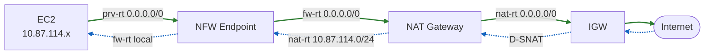

# 使用 AWS Network Firewall 检测带有 NAT 的出站流量

本方案在 [`nfw-vgw-demo`](https://github.com/aobao32/nfw-vgw-demo) 的基础上 fork 而来。原有架构的架构中，已经搭建好的部分包括 VGW + Site-to-Site VPN + BGP 用于模拟 IDC 到云端的 DX 专线，NFW 负责检测 IDC 和云上 VPC 之间的流量。本方案在原有架构保留的基础上，为云端 VPC 增加了自己的 Internet Gateway 和 NAT Gateway，使云上 EC2 具备互联网出口，并且新增 NFW 对云上 VPC 去往互联网出站流量进行审查。

与原 [`nfw-vgw-demo`](https://github.com/aobao32/nfw-vgw-demo) 的差异：**本方案的出站检查路由（南北向）由 CloudFormation 模板在创建时自动生效，创建完成后 NFW 立即开始扫描出站互联网流量，无须手工配置**。模拟 IDC 到云上 VPC 的路由（东西向）则与原方案 CloudFormation 模版保持一致，即创建完毕后流量默认不经过 NFW 检测，需手工修改路由表将流量送往 NFW 才会检测流量。

全文技术术语缩写与原方案保持一致：

| 全称 | 简称 |
| --- | --- |
| Network Firewall | NFW |
| Internet Gateway | IGW |
| NAT Gateway | NAT |
| Transit Gateway | TGW |
| Direct Connect | DX |
| CloudFormation | CFN |
| Virtual Private Gateway | VGW |
| Border Gateway Protocol | BGP |

在云上创建好的资源名称使用如下简写：

| 全称 | 简称 |
| --- | --- |
| Availability Zone | az |
| Route Table | rt |
| Private | prv |
| Network Firewall | fw |

## 一、新增去往互联网的 NAT 时架构设计思路

### 1、是否需要多个 NFW 和 多个 Endpoint 的思考 

首先定义流量方向：

- 东西向：水平方向，指 VPC 和 IDC 之间，或者多个 VPC 之间。本文特指 IDC 到 VPC。
- 南北向：垂直方向，指 VPC 去互联网，从互联网入 VPC。本文特指仅检查从 VPC 去互联网的出站流量。

本方案的南北向流量中，云上 VPC 目前没有从互联网入站的流量（没有 ELB，EC2 也没有 EIP），因此 NFW 只检测 EC2 主动发起、去往互联网方向的出站流量。在此情况下，东西向和南北向的检测可共用一套 NFW ，也就是一个创建一个统一的 NFW Profile，在 NFW Rule Group 部分，分别填写东西向和南北向需要的扫描规则即可，这些规则因为有不同的源/目标 IP 地址，因此规则之间不会冲突。

于此同时，因为检测的流量是从 VPC 去往互联网出站的，没有涉及到从互联网通过 ELB 入站的流量，因此每个 AZ 只需 1 个 NFW Endpoint 即可承载检测。当以后架构中增加了 ELB，并需要检测从互联网入站的流量，那么出于要保留 source IP 的要求，在每个 AZ 内就需要 2 个 Endpoint 来分别处理入站与出站。

### 2、流量通过 NFW 和 NAT 的顺序问题

出站流量经过 NAT 和 NFW，有两种串联顺序，二者的核心区别在于 NFW 看到的源 IP 不同。

#### (1) 先 NAT 后 NFW（NFW 在 NAT 与 IGW 之间）

流量路径为 `EC2 → NAT → NFW → IGW`。NAT 先做了 SNAT，把源地址换成了 NAT 的 EIP，因此 NFW 看到的所有出站流量源 IP 都是 NAT 的公网地址，无法区分是哪一台 EC2 发出的。这种顺序会**丢失原始 source ip**，不利于按业务子网或单机做策略与审计。

#### (2) 先 NFW 后 NAT（NFW 在 EC2 与 NAT 之间）

流量路径为 `EC2 → NFW → NAT → IGW`。NFW 先做检查然后流量才抵达 NAT 转换，此时 NFW 中看到的报文源地址仍是 EC2 的私网地址（`10.87.114.x` / `10.87.113.x`），NFW 日志和规则都能看到真实的 source ip，可以基于业务子网精确制定策略。NAT 只在流量离开 NFW 之后才做 SNAT。

#### (3) 本方案的选择

本方案采用**先 NFW 后 NAT**。为保持可用区隔离，NAT 与 NFW Endpoint 均按 AZ 成对部署，AZ1 的业务流量只走 AZ1 的 NFW Endpoint 与 AZ1 的 NAT，AZ2 同理，避免跨 AZ 流量与额外费用。

### 3、本方案新增的资源

本方案在原项目 `nfw-vgw-demo` 的基础上新增以下资源（均为本 fork 新增，不影响原有 VGW/VPN/BGP 部分）：

- 1 个 Internet Gateway：`Inspection IGW`
- 2 个 NAT 子网（公有）：`NAT subnet AZ1` = `10.87.116.0/28`，`NAT subnet AZ2` = `10.87.116.16/28`
- 2 个 NAT Gateway（各带 1 个 EIP）：`NAT Gateway AZ1`、`NAT Gateway AZ2`
- 2 张 NAT 子网路由表：`nat-rt-az1`、`nat-rt-az2`

子网 CIDR 设计新增：

- 新增 NAT 子网（`10.87.116.0/28`、`10.87.116.16/28`）。

### 4、路由表设计

以下资源缩写名称代表的含义，请参考本文片头的术语表。

#### (1) 出站方向路由（从 EC2 出站去互联网）

| 路由表 | 关联对象 | 目的 CIDR | 下一跳 | 说明 |
|---|---|---|---|---|
| `prv-rt-az1` | 业务子网 AZ1 | `0.0.0.0/0` | NFW Endpoint AZ1 | 默认去互联网先送 NFW（本模板自动创建）|
| `prv-rt-az2` | 业务子网 AZ2 | `0.0.0.0/0` | NFW Endpoint AZ2 | 同上 |
| `fw-rt-az1` | 防火墙子网 AZ1 | `0.0.0.0/0` | NAT Gateway AZ1 | NFW 检查后送 NAT 做 SNAT |
| `fw-rt-az2` | 防火墙子网 AZ2 | `0.0.0.0/0` | NAT Gateway AZ2 | 同上 |
| `nat-rt-az1` | NAT 子网 AZ1 | `0.0.0.0/0` | Inspection IGW | SNAT 后出公网 |
| `nat-rt-az2` | NAT 子网 AZ2 | `0.0.0.0/0` | Inspection IGW | 同上 |

#### (2) 出站后回包方向路由（从互联网返回 EC2 ）

注意：这里的路由条目是上一步出站流量的回程包，并不是指通过 ELB 或者 EIP 从互联网访问 VPC 内资源的。请注意区分二者定义的区别。

出站后的流量回包报文到达 NAT 完成 D-SNAT 后，目的地址变回 EC2 的私网地址。NAT 子网路由表用一条比本地 `10.87.0.0/16` 更精确的 `/24` 路由，把回程流量引回 NFW Endpoint，确保来回都过防火墙：

| 路由表 | 目的 CIDR | 下一跳 | 说明 |
|---|---|---|---|
| `nat-rt-az1` | `10.87.114.0/24` | NFW Endpoint AZ1 | 回程引回防火墙（更长掩码优先于 local）|
| `nat-rt-az2` | `10.87.113.0/24` | NFW Endpoint AZ2 | 同上 |

NFW Endpoint 完成回程检查后，按防火墙子网路由表的 `local` 路由把报文直接送回业务子网的 EC2。

注意：在某些特定 NFW 部署方案时，经常需要配置一张所谓的“边缘绑定”路由表，在路由表绑定子网位置，选择边缘绑定，并选择本 VPC 的 IGW，它会负责特定流量的“劫持”和引导。在本方案下，并不需要这种特殊配置。因为 EC2 先经过 NFW 再经过 NAT，最后才通过 IGW。在本方案的 IGW看来，IGW 收到 NAT 发来的正常通信，无须为 IGW 配置边缘绑定的路由表。

#### (3) 完整流量路径



在上图中，实线（绿色）为出站方向 `EC2 → NFW → NAT → IGW → Internet`。虚线（蓝色）为回程方向 `Internet → IGW → NAT(de-SNAT) → NFW → EC2`。来回都经过 NFW，保证有状态检测对称。

### 5、新增南北向检测与原有东西向流量检测不冲突的说明

原方案的 CloudFormation 拉起后，去往 IDC 方向（东西向）流量默认不经过 NFW，如果要检测需要手工调整路由表将流量送往 NFW。本方案的 CloudFormation 拉起后，也遵循这个原则，这与之前的模版行为保持一致。那么如何区分东西向流量还是南北向流量呢？是通过路由表中下一跳目标地址来确定。下一跳是 IDC 的 IP CIDR，则属于东西流量，写为 `0.0.0.0/0` 则表示去往互联网任意地址，属于南北向流量。

在 CloudFormation 启动完成后，在云上的 VPC 的防火墙子网与业务子网，与原方案一样开启了 VGW 路由传播。BGP 传播过来的 IDC 网段（`10.0.0.0/16`、`10.132.66.0/24`）掩码比 `0.0.0.0/0` 更精确，因此去 IDC 的东西向流量仍走 VGW，只有去互联网的默认流量才会命中本方案新增的 `0.0.0.0/0 → NFW → NAT` 路径。

### 6、设计小结

以上几个话题讨论完毕。到这里，我们已经有了完整路由表设计，现在使用 CloudFormation 构建新的环境。

## 二、使用 CFN 模板启动环境

### 1、获得模版

本方案使用的 CloudFormation 模板位于 Github 这里：[https://github.com/aobao32/nfw-vgw-and-nat-demo/tree/main/cloudformation](https://github.com/aobao32/nfw-vgw-and-nat-demo/tree/main/cloudformation)

该模板在原 [`nfw-vgw-demo`](https://github.com/aobao32/nfw-vgw-demo) 模板基础上 fork，新增了 IGW、NAT 子网、NAT Gateway、NAT 路由表，以及出站域名拦截规则，并自动写好出站检查路由。创建完成后即可直接验证 NFW 对出站流量的检测，无须手工配置路由。

### 2、创建前置条件

注意：必须有 EC2 KeyPair 存在，否则模版创建失败。

- 在目标区域已有一个 EC2 密钥对（`KeyPairName` 参数引用，用于 EC2 SSH，本方案登录主要用 SSM）
- 账号默认 VPC、EIP 配额足够：本模板新建 2 个 VPC，新建 3 个 EIP，分别是 strongSwan 1 个 + NAT 2 个
- 登录 AWS 控制台的 IAM User 具备使用 CloudFormation 以及创建 VPC、NFW、NAT、IAM、Lambda、CloudWatch Logs 的权限

### 3、创建步骤

- 1) 进入 CloudFormation 控制台，选择创建 Stack，上传模板 `vpc-dual-az-vgw-vpn-bgp-nfw-nat-create.yaml`
- 2) 填写 Stack 名称，从本 AWS 账号现有的 EC2 密钥下拉框中，选择登录新创建 EC2 的 `KeyPairName`，其余参数可用默认值（其中 VPN 预共享密钥建议改为自定义密钥）
- 3) 在权限确认页面勾选允许创建 IAM 资源，提交创建
- 4) 等待约 20-30 分钟，Stack 状态变为 `CREATE_COMPLETE`

也可使用 CLI 创建（也需要等待 20-30 分钟）：

```bash
aws cloudformation create-stack \
  --stack-name nfw-nat-demo \
  --template-body file://cloudformation/vpc-dual-az-vgw-vpn-bgp-nfw-nat-create.yaml \
  --parameters ParameterKey=KeyPairName,ParameterValue=<你的密钥对名称> \
  --capabilities CAPABILITY_IAM
```

### 4、创建完成后的状态

- CloudFormation 显示 Stack 创建完成
- NFW 已创建并就绪，两个 AZ 的 NFW Endpoint 已生成
- 出站检查路由已由模板自动写入 `prv-rt`、`fw-rt`、`nat-rt`
- NFW 策略采用严格顺序（STRICT_ORDER），规则优先级为：
  - 优先级 1：`block-idc-http`，丢弃 IDC → 云端业务子网 TCP/80（继承自原方案）
  - 优先级 2：`block-egress-domain`，丢弃云端去往特定域名的 HTTP/HTTPS 出站（本方案新增，用于演示出站检测）
  - 优先级 100：`allow-all`，放行其余流量（放行已建立的 TCP「客户端→服务器」方向、以及 UDP、ICMP）

> 注意：CloudFormation 显示绿色后，VPN 隧道与 BGP 会话可能还需要再等 5-10 分钟才完全建立。出站互联网检测不依赖 VPN/BGP，可立即验证；IDC 东西向相关验证需等待 BGP 收敛。

## 三、验证 NFW 对出站流量的检测工作正常

### 1、登录 EC2 执行命令 

云上业务 EC2 位于私有子网，通过 SSM Session Manager 登录（VPC 内已部署 SSM 接口终端节点，无须公网登录）。

- 1) 进入 EC2 控制台，选择 `Workload AZ1 (inspection)` 或 `Workload AZ2 (inspection)`
- 2) 点击 `Connect` → 选择 `Session Manager` 标签页 → 连接

登录后执行以下命令验证出站检测效果：

```bash
# 1) 访问被拦截的域名 google.com —— 预期返回失败/超时（匹配 block-egress-domain 规则）
curl -v --max-time 10 http://google.com
curl -v --max-time 10 https://google.com

# 2) 访问其他域名 —— 预期返回成功（匹配 allow-all 规则，经 NFW 检查后放行出网）
curl -v --max-time 10 https://aws.amazon.com

# 3) 查看本机出站公网 IP —— 返回的是 NAT Gateway 的 EIP，证明流量经过了 NAT
curl -s --max-time 10 https://checkip.amazonaws.com
```

预期结果：

- 访问 `google.com` 的 HTTP 与 HTTPS 均被 NFW 丢弃（连接超时或被重置）
- 访问其他域名正常返回，说明默认放行的出站流量经 NFW 检查后通过 NAT 出网
- `checkip` 返回的公网 IP 等于 `NatEIPAZ1Address` / `NatEIPAZ2Address`（见 Stack 的 Outputs），证明出站路径确实是 `EC2 → NFW → NAT → IGW`

### 2、查看 NFW 日志

进入 CloudWatch 控制台 → 日志 → 日志组，查看以下两个日志组（`<stack-name>` 为你的 Stack 名称）：

- `/aws/network-firewall/<stack-name>/flow`：所有连接的流日志，可看到出站连接的源（EC2 私网 IP）、目的、端口
- `/aws/network-firewall/<stack-name>/alert`：命中 alert/drop 规则的事件日志

查看 NFW 审查的日志：

- 在 `flow` 日志中，出站连接的源地址应为业务 EC2 的私网地址（`10.87.114.x` / `10.87.113.x`），证明 NFW 在 NAT 之前就看到了真实 source ip
- 在 `alert` 日志中，应能看到访问 `google.com` 被丢弃的记录，`event.alert` 字段包含 `Block egress ... to google.com`
- 可用 Logs Insights 进一步检索，例如按 `event.alert.signature` 或源/目的 IP 过滤

完成以上验证，即可确认 NFW 正确检测并按策略拦截了云上 EC2 的出站互联网流量。

## 四、NFW 配置中的参数和规则设计讨论

本章节探讨下 NFW 使用过程中一些参数的选择和规则的设置。

### 1、NFW 的 Stateful 默认规则的选择

2026 年 6 月，AWS 调整了新创建的 Stateful 规则的默认动作，从过去默认的 Application drop established (bidirectional) 更换为 Application drop established (server-directed only)。由此提升了一些复杂规则场景下的健壮性和稳定性。

以一个 7 层过滤规则的场景为例，以前使用 `Application Drop established（双向，bidirectional）` 默认规则时候，当客户端和服务器端双方开始进入 TCP 的握手步骤时候，还没有传输 SNI 信息。由于不知道要访问的域名，此时 NFW 防火墙的 7 层域名过滤放行规则还没有生效。此时服务器向客户端发出一些典型的流量控制规则：

- TCP window updates（服务端通告窗口变化）
- TCP keep-alives（保活探测）
- TCP resets / RST（服务端主动断开）

遇到这些数据包时，由于后续包含 7 层访问请求的规则尚未被触发，NFW 会判定当前数据包是没有匹配到任何一条 PASS 规则，因此就会按照没有匹配的行为丢弃这些服务器流控包，导致用户访问过程出现偶发卡住、偶发中断、长连接掉线等行为。此时日志中看不到记录，因为此时还没有进入完整的 Stateful 规则处理，拦截这些流控包的不是 Stateful 匹配的 7 层域名规则，而是防火墙默认行为。因此，使用 `Application drop established (server-directed only)` 这个规则，可以很好的适配 7 层 URL 规则场景。

此外，选择 `Drop established` 也能满足放行服务器端发来的流控包的条件，但是在进行 7 层检测时候，如果遇到 SNI 和 Host 检测被触发之前服务器端发来的分段的 HTTP 请求，可能会被 NFW 丢弃。因此如果有 7 层检测规则，不建议使用 `Drop established`。

根据以上信息，本方案使用 `Application drop established (server-directed only)` 作为默认规则。

### 2、不完整包的处理规则

在 NFW 的策略（Policy）页面中，创建策略时候有个选项是：


这里解释这个参数的作用。NFW 的有状态引擎（Suricata）会为每条 TCP/UDP 连接维护一个会话上下文（state/flow context），记录这条流从握手开始的协议识别结果、方向、应用层协议等信息，规则匹配很多时候依赖这个上下文。而 Stream exception policy 指当收到不完整的包或者现有流丢失或断裂时（midstream break），后续到达防火墙的报文该怎么处理。例如，当 NFW 引擎触发了 AZ 切换/自身容量缩放等导致连接中断，或者是流量来回双向路由不对等走了不同的路径，此时防火墙收到了不完整的包，此时针对后续继续发过来的流量，防火墙采取丢弃/放行/拒绝哪一种行为。

三个选项功能如下：

- 丢弃：防火墙丢弃不完整的流后续的包。这通常导致客户端不知情并卡住，直到客户端自己 timeout 才会重新传输
- 继续放行：可能会导致某些流量本该被拦截，但是继续通过了 NFW 
- 拒绝：NFW 向客户端发出 TCP RST 包，客户端会立即收到重置，并重新建立连接，重新发送完整整个流完整的包

以上选项，默认是丢弃（Drop），建议修改为 Reject 拒绝，这样遇到类似场景，客户端会主动重新连接，不会影响连接质量。

### 3、闲置超时的配置修改

NFW 对于长连接的管理是需要特别注意，由于防火墙不可能维护无限数量的长连接，其引擎能处理的连接数有限，因此会自动关闭处于闲置状态的长连接。而应用软件在维护长连接时候，经常会隔一段时间发送 Keepalive 包，宣称自己的长连接并不是闲置的，以此要求 NFW 维护客户端和服务器之间的长连接。

默认 NFW 的闲置超时是350秒。如果应用层发送 Keepalive 包间隔比较长，例如每 10 分钟（600秒）才发送一次 Keepalive 包，那就会出现问题，还没等应用程序自己确认存活，NFW 就把连接判定为空闲而关闭了。这种情况下，如果客户端还继续发送包，就会被 NFW 引擎 Drop 掉。

针对长连接闲置超时，此时有两种处理办法：

- (1) 将应用程序或者客户端/服务器端操作系统发送 Keepalive 包的间隔调小，即调整到 350 秒以下，让双方频繁发送探活包，以维持长连接存活
- (2) 将 NFW 判定闲置超时的窗口从 350秒 调高，例如设置到1200秒。

针对第一种调整客户端的处理办法，MySQL/PostgreSQL 数据库连接池、SSH、WebSocket、HTTP 2.0、RPC调用等长连接，建议在应用层或者应用程序所在的 OS/容器层面开启 Keepalive，确保过一会能自动发送探活包。

针对第二种调整 NFW 闲置超时，方法如下。进入 NFW 的策略编辑菜单，切换到最后一个标签页，详细信息，其中可找到超时设置。如下截图。


修改为1200秒。如下截图。


保存后，需要等待几分钟时间，NFW 规则才会生效。

### 4、检测 7 层域名时的规则写法

在 strict order 模式下做黑名单方式的域名拦截，兜底对其他所有域名都放行规则的写法是关键。

#### (1) 本方案的规则写法

```
优先级 1   : drop tcp [IDC] any -> [云端子网] 80                   (4层规则的端口拦截)
优先级 2   : drop http/tls ... content:"google.com"                 (7层规则域名拦截)
优先级 100 : pass tcp any any -> any any (flow:established,to_server; ...)
             pass udp any any -> any any
             pass icmp any any -> any any
策略默认动作: aws:drop_established_app_layer_to_server
```

以上规则可以看到，放行的写法是带有额外参数的，如果只写简单 pass，那么过滤域名的检测规则就会失效。

#### (2) 为什么不是简单 pass_all 而是 pass 后必须加 flow:established,to_server 参数

而 Suricata 对 `pass` 的语义是：流中任一个包命中 `pass`，整条流后续包直接放行、不再过规则。如果优先级 100 写成 `pass ip any any`，那么针对被拦截域名的访问流量就会出现如下场景：

- 客户端发来 SYN 包，优先级 1 的 4 层规则没匹配上，继续下一条规则
- SYN 包只有 4 层信息是不含 7 层请求域名信息的，因此优先级为 2 的规则虽然想过滤域名，但现在检测不到，继续下一条规则
- 优先级 100 的兜底规则命中并触发**整流放行**

由此可以看到，一旦写了整体 pass 的规则，整个流都放行了，这个流后面的带 `Host` 的 HTTP GET 包根本进不了规则引擎，优先级为 2 的域名过滤黑名单规则的 drop 操作永远不会被匹配。

当给 pass 加上 `flow:established,to_server` 参数后，整体放行规则只发生在「连接已建立 + 客户端→服务器」的应用层数据包上才匹配，而不是从像刚才那样 SYN 开始就完全放行。此时域名 drop（优先级 2）和兜底 pass（优先级 100）是在同一个检查序列上，优先级小的先生效，由此触发了拦截才真正生效。

注意：端口规则 `block-idc-http` 不受影响，因为这个规则是 4 层协议，和优先级 2 的 7 层协议不在一个维度。因此无论放行规则的参数怎么写，4 层规则都有效。

#### (3) 针对 7 层拦截规则、不含域名的 SYN 握手包 NFW 怎么处理

上一个小节讲述到 SYN 规则不含 7 层信息，那么 SYN 是如何被 NFW 处理的呢？当一个 SYN 包没有匹配到任何 4 层规则的时候，NFW 使用策略默认 `aws:drop_established_app_layer_to_server` 来判断这个包是否放行。

本章节的第一个小节探讨这个默认规则的设置。这个规则是应用层感知的，即先放行3层、4层握手和服务器返回方向，然后仅丢弃「已建立的连接中客户端→服务器方向」没有被规则 pass 放行的包，同时这个默认规则还对分段 TLS ClientHello / HTTP 请求做重组判定。因此选这个默认策略，即可在尚未收到 7 层请求的 SNI、HTTP Host 信息之前，先放行这几个包，再根据整个流后续的包决定是否放行或拦截。由此就不会触发整个流被直接放行或者整个流被完全丢弃的场景了。

以上几个章节是对 NFW 规则配置的一些详细探讨。

## 五、关于 NFW Idle Timeout 闲置超时的补充说明

在上一个章节，已经介绍了 NFW 闲置超时的设置修改。这里进行验证。

首先将 NFW 的 Idle Timeout 从本 CloudFormation 默认的 1200+ 秒调整为 60 秒，便于快速实验。

### 1、为 IDC 和 云上 VPC 之间的流量启用 NFW 

这需要修改路由表，使得流量被引导通过 NFW 。修改方法可以参考之前的[这篇](https://blog.bitipcman.com/post/nfw-vgw-demo/)博客。

### 2、模拟一个 SSH 访问并闲置 60 秒后触发 Idle Timeout 

从代表云上 VPC 环境的 EC2 用 SSH 登录模拟 IDC 的 EC2。

SSH 登录成功后，等待数秒后，查看 CloudWatch LogGroup 中 NFW 的 Flow 日志，可以看到 SSH 建立成功的记录。

闲置 60 秒以上，可看到 SSH 卡死，按回车也没有反应。如果您等待足够长的时间，等客户端自己多次重试（自动地按照指数退避逐渐增大重试间隔），数分钟后才会收到 `client_loop: send disconnect: Broken pipe` 的报错信息。

### 3、从 NFW 的 Flow 日志对 Idle Timeout 做行为分析

进入 CloudWatch LogGroup 中 NFW 的 Flow 日志，观察可找到类似如下信息：

```json
{
  "firewall_name": "nfw-test-os-keepalive-firewall",
  "availability_zone": "ap-northeast-1a",
  "event_timestamp": "1783175697",
  "event": {
    "tcp": {
      "tcp_flags": "1a",
      "syn": true,
      "psh": true,
      "ack": true
    },
    "app_proto": "ssh",
    "src_ip": "10.87.114.52",
    "src_port": 45096,
    "netflow": {
      "pkts": 154,
      "bytes": 17367,
      "start": "2026-07-04T14:33:51.321717+0000",
      "end":   "2026-07-04T14:33:55.871232+0000",
      "age": 4,
      "min_ttl": 63,
      "max_ttl": 63,
      "state": "established",
      "reason": "timeout",
      "alerted": false,
      "tx_cnt": 1
    },
    "event_type": "netflow",
    "flow_id": 2226192497599167,
    "dest_ip": "10.132.66.200",
    "proto": "TCP",
    "dest_port": 22,
    "timestamp": "2026-07-04T14:34:57.468453+0000"
  }
}
```

关键字段的解读如下：

| 字段 | 值 | 含义 |
|---|---|---|
| tcp.tcp_flags | "1a" (十六进制)	| "1a" = 0x02(SYN) + 0x08(PSH) + 0x10(ACK) = 26。RST 位是 0x04，没置位 |
| tcp.rst	| 字段缺失 | 若曾出现 RST 应为 true。缺失=false |
| netflow.reason | "timeout" | flow 关闭原因是 idle age-out。不是 "reset"，也不是 "stream_exception" |
| netflow.state	| "established" | flow 关闭时的最终 TCP 状态。没有变成 "closed" |
| netflow.alerted	| false	| Suricata 引擎规则：整条 flow 期间没有触发过任何 stateful rule alert |

通过以上信息可以获得结论：

- NFW 关闭长连接时候，直接从 `established` 状态关闭，不会进入 `Closed` 状态
- NFW 处理 Idle Timeout，是直接回收连接资源，不属于异常流量 `stream_exception` 的包，因此不会触发 RST
- NFW 管理连接时候，不会在 Alert 日志中记录，只在 Flow 日志中从长连接发起方向，记录到 `"reason": "timeout"` 的信息，反向不会记录 timeout 信息
- 对已经被回收的长连接，后续两端如果继续发包，NFW 直接丢弃，不属于异常流量 `stream_exception` 的包，不会再补发 RST，同时 日志 Alert 中也不会记录

### 4、如何从 NFW 的 Flow 日志中查找闲置超时 Idle timeout 的记录

以上结论可以看出，查找长连接失效的办法，就是搜索 Flow 日志，查找关键字 `"reason": "timeout"` 的信息。

#### (1) 使用 AWS CloudWatch 控制台上 Log Analytics 的方法

进入 AWS 控制台，进入 CloudWatch 服务，在左侧菜单中，找到 `Log Analytics`，然后在右侧的 `Data sources` 检索框中选择 NFW 的 Log Groups 的名字，最后在查询框输入如下代码：

```shell
fields event.src_ip as src_ip,
       event.src_port as src_port,
       event.dest_ip as dst_ip,
       event.dest_port as dst_port,
       event.app_proto as app,
       event.netflow.age as active_age,
       event.netflow.pkts as pkts,
       event.netflow.bytes as bytes,
       event.netflow.start as flow_start,
       event.netflow.end as flow_end,
       event.timestamp as flow_gc_ts
| filter event.netflow.reason = "timeout"
     and event.proto = "TCP"
     and event.netflow.state = "established"
| parse flow_start /(?<sh>\d\d):(?<sm>\d\d):(?<ss>\d\d\.\d+)/
| parse flow_end   /(?<eh>\d\d):(?<em>\d\d):(?<es>\d\d\.\d+)/
| parse flow_gc_ts /(?<gh>\d\d):(?<gm>\d\d):(?<gs>\d\d\.\d+)/
| fields (gh * 3600 + gm * 60 + gs) - (sh * 3600 + sm * 60 + ss) as total_life,
         (gh * 3600 + gm * 60 + gs) - (eh * 3600 + em * 60 + es) as idle_duration
| display total_life, active_age, idle_duration, pkts, bytes, app,
          src_ip, src_port, dst_ip, dst_port, flow_start, flow_gc_ts
| sort total_life desc
| limit 20
```

查询结果如下截图。


由此就可以查询到近期发生闲置超时的长连接。

#### (2) 使用 AWS CLI 脚本（要求本机有 AKSK 密钥）

脚本有几个环境变量可以设置：

- NFW_REGION
- NFW_LOG_GROUP
- NFW_WINDOW_HOURS
- NFW_TOP_N

这些环境变量可以在脚本开头修改，也可以在 shell 上以环境变量方式传入。保存后赋予脚本可执行权限。

执行脚本：

```shell
./nfw-idle-report.sh
```

返回结果如下：

```shell
region:        ap-northeast-1
log-group:     /aws/network-firewall/nfw-test-os-keepalive/flow
window:        past 24h
top-N:         20

被 NFW idle timeout 静默切断的 TCP 长连接: 1 条

====================================================================================================================================================
Top 20 明细，按 total_life 排序 (连接从建立到被 NFW 闲置切断的持续时长):
====================================================================================================================================================
total_life active_age idle_duration   pkts    bytes     app  src                    -> dst                    start               evt_ts             
     66.1s       4.0s         61.6s    154    17367     ssh  10.87.114.52:45096     -> 10.132.66.200:22       2026-07-04T14:33:51 2026-07-04T14:34:57

字段说明:
  total_life    = 连接总持续时长 (从 flow 建立、到处于活跃、到闲置下来被 NFW 切断, 即 active_age + idle_duration)
  active_age    = 闲置下来之前，本 flow 的活跃期 (进入闲置前最后一个包的时间 - 第一个包的时间)
  idle_duration = 最后一个包 到 NFW 切断的闲置时长 (≈ NFW 配置的 idle_duration 设置 + NFW 采样延迟)
```

由此即可找到日志中发生了 Idle Timeout 的长连接。

### 5、为 OS 配置系统级 Keepalive 以维持长连接

以上过程介绍了 NFW 在处理长连接闲置超时也就是 Idle Timeout 时候的规则，现在来验证增加 Keepalive 配置能否主动维持空闲的长连接，以确保不会被 NFW 判定为 Idle。

通常而言，在如下几个地方会有关于 Keepalive 的配置，不同的软件启用方式不一样：

- 客户端和服务器端操作系统层面（Linux 通常是 7200 秒）
- 客户端软件（如本例的 SSH Client）
- 服务器端软件（如本例的 SSH Server）

这几处通常需要显式地加入 Keepalive 参数，才会让连接双方主动发送 Keepalive 包维持连接。

以上文测试的 SSH 连接为例，客户端默认 `ServerAliveInterval = 0`，服务器端 `ClientAliveInterval = 0` 也是不发送 Keepalive，操作系统默认是 7200 秒。由于 NFW 默认最小 60 秒、最大 6000 秒，明显小于 Keepalive 包发送间隔，因此 NFW 就判定长连接为闲置，然后中断连接了。

为了维持长连接不闲置，可修改客户端、服务器端软件的配置，还可以修改操作系统的配置。

以修改操作系统配置为例，在客户端和服务器端两边的操作系统上，修改 `/etc/sysctl.conf`，加入如下配置：

```shell
net.ipv4.tcp_keepalive_time = 45
net.ipv4.tcp_keepalive_intvl = 30
```

以上表示当连接空闲下来没有数据传输时候，等待 45 秒发送第一个 Keepalive 包，然后每隔 30 秒重复发送 Keepalive 包。注意：真实的操作系统环境一般不需要设置得这么小，因为上文为了更快获得长连接闲置效果，将 NFW 的闲置超时调整为了 60 秒，这是为了更快地完成测试。在正常环境中，确保这两个间隔都小于 NFW 配置的空闲超时即可。

配置完毕后，重新加载系统参数，无须重启。

```shell
sudo sysctl -p
```

现在，重复之前章节的 SSH 登录并闲置试验，登录成功后什么都不要做，等待数个 60 秒后（确认 NFW 配置的闲置超时是 60 秒），再看 SSH 连接是否还在正常活跃，即可验证。

### 6、小结

以上章节介绍了如何通过 NFW 的 Flow 日志观察长连接的 Idle Timeout 闲置超时情况，并且验证了修改操作系统的 Keepalive 设置可维持长连接的有效性。

## 六、清理环境

在实验结束后，需要清除实验环境。进入 CloudFormation 服务，直接删除 CloudFormation Stack 即可。模板内置的 Lambda 自定义资源会在删除前自动清理指向 NFW Endpoint 的路由，可避免「related VPC endpoint(s) still exist in route table(s)」导致防火墙删除失败。

## 七、参考文档

[带有 Internet Gateway 和 NAT Gateway 的 NFW 架构](https://docs.aws.amazon.com/network-firewall/latest/developerguide/arch-igw-ngw.html)

[Network Firewall 路由表示例架构](https://docs.aws.amazon.com/zh_cn/network-firewall/latest/developerguide/route-tables.html)

[组合 Ingress 与 Egress 检测时的源 IP 可见性](https://repost.aws/articles/ARYy1Pfr4BQOGvxntapZBgSQ/source-ip-visibility-for-combined-ingress-and-egress-inspection-architectures)

[使用 NAT Gateway 与 Network Firewall 实现集中式 IPv4 出站](https://docs.aws.amazon.com/whitepapers/latest/building-scalable-secure-multi-vpc-network-infrastructure/using-nat-gateway-with-firewall.html)

[2026年6月起 NFW 调整新创建的 Stateful 规则的默认动作](https://aws.amazon.com/about-aws/whats-new/2026/06/aws-network-firewall-updates-default-drop-action/)

[Managing evaluation order for Suricata compatible rules in AWS Network Firewall](https://docs.aws.amazon.com/network-firewall/latest/developerguide/suricata-rule-evaluation-order.html)